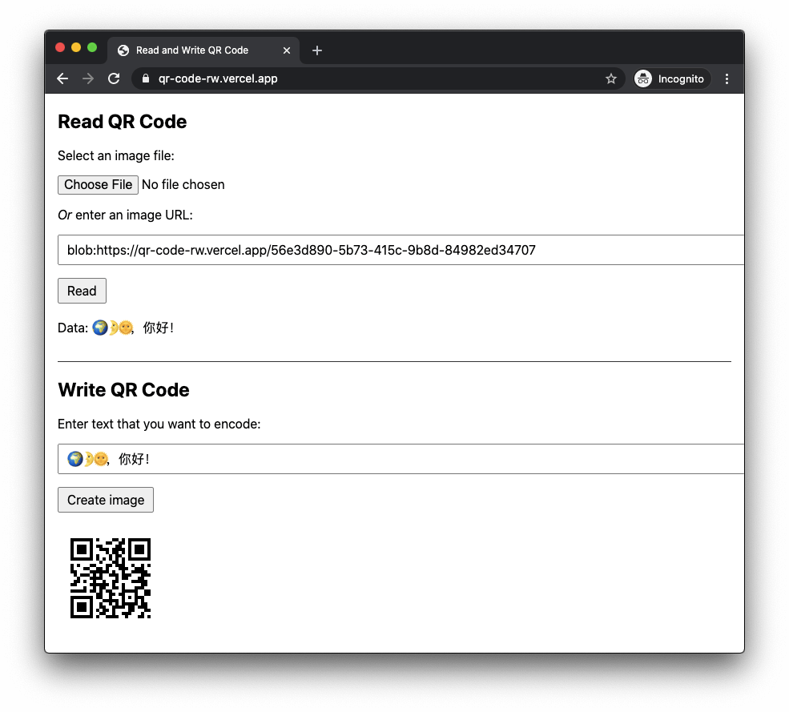

# Read and Write QR code

A website and API to decode QR code in image and encode text into QR code.

## Website

https://qr-code-rw.vercel.app/



## API

Both of the following API supports CORS.

### Create QR code from text

Supply the text you want to encode in the `text` query parameter, e.g.,

https://qr-code-rw.vercel.app/api/encode?text=hello-world

If success, the output is a PNG image, otherwise, the output is a JSON object
which will explain the reason.

```
# Success
$ curl -v 'https://qr-code-rw.vercel.app/api/encode?text=hello-world' -o hello.png

# Failure
$ curl 'https://qr-code-rw.vercel.app/api/encode'
{
  "error": "Missing argument: text"
}
```

### Read QR code in image

POST your image to https://qr-code-rw.vercel.app/api/decode

For example,

```
~ $ curl -i --data-binary @hello.png https://qr-code-rw.vercel.app/api/decode
HTTP/2 200
content-type: application/json
cache-control: s-maxage=31536000
date: Sun, 23 Aug 2020 04:12:40 GMT
access-control-allow-origin: *
content-length: 27
x-vercel-cache: MISS
server: Vercel
x-vercel-id: hkg1::sfo1::6bdr2-1598155959204-5c19297a0e3a
strict-transport-security: max-age=63072000; includeSubDomains; preload

{
  "data": "hello-world"
}
```

Or if the image is online, you can send a GET request with `imgsrc` query
parameter, for example, you want to decode QR code in
https://upload.wikimedia.org/wikipedia/commons/a/a7/Z80-Tianjin_-Beijing.jpg

```
~ $ curl 'https://qr-code-rw.vercel.app/api/decode?imgurl=https://upload.wikimedia.org/wikipedia/commons/a/a7/Z80-Tianjin_-Beijing.jpg'
{
  "data": "360848320672724996367623994228900041735739942854066845825761815943200000000000000000000053897628805389762880538976288053897628805389762880437000"
}
```

## How it work?

It uses these Node.js packages:

- sharp to read images
- jsqr to decode qr code
- qrcode to encode qr code

The front end is plain HTML/CSS/JavaScript. The backend uses builtin Node.js
library, besides the above three packages.

## How to run it locally?

Vercel is required

```
$ vercel dev
```

## Privacy

The hosting is provided by Vercel. I don't process or store logs.
